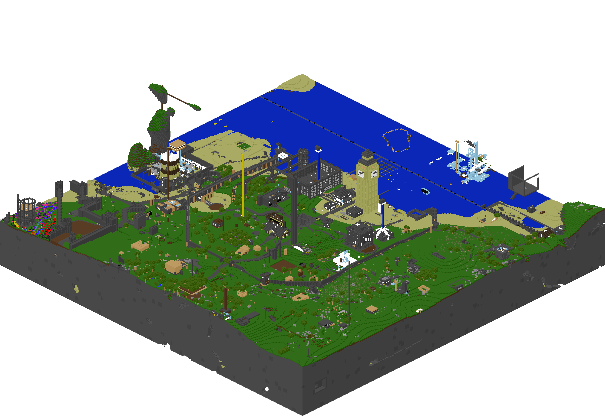
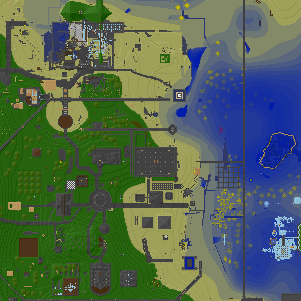

Minetest map renderer go-library and cli


[](https://coveralls.io/github/minetest-go/maprenderer)

# Usage

```sh
# show help and usage
./maprenderer -help
```

## Isometric map

```sh
./maprenderer -world /home/user/.minetest/worlds/myworld/ -from -200,-50,-200 -to 200,100,200 -type isometric
```

Example output:



## Flat map

```sh
./maprenderer -world /home/user/.minetest/worlds/myworld/ -from -200,-50,-200 -to 200,100,200 -type map
```



# Custom `colors.txt`

If a custom color-mapping is needed a `colors.txt` can be placed in the world-directory in the following format:
```
# node:name r g b
nc_terrain:cobble 10 20 30
```

# Binary downloads

See: https://github.com/minetest-go/maprenderer/releases

# License

Code: **MIT**

Other assets
* `colormapping/testdata/unifieddyes_palette_extended.png` GPL 2.0 https://github.com/mt-mods/unifieddyes/blob/master/textures/unifieddyes_palette_extended.png